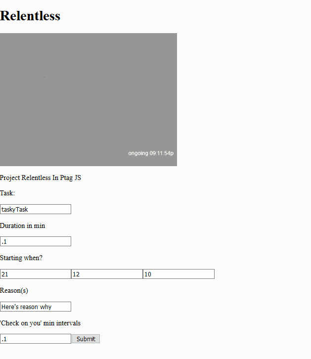
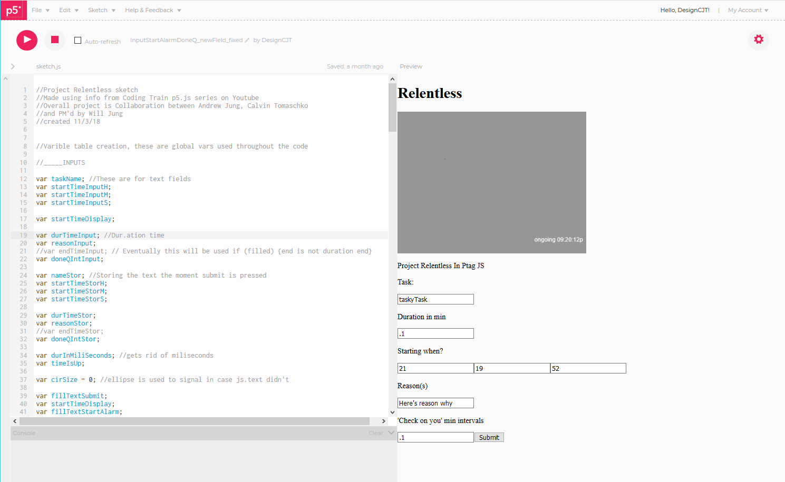
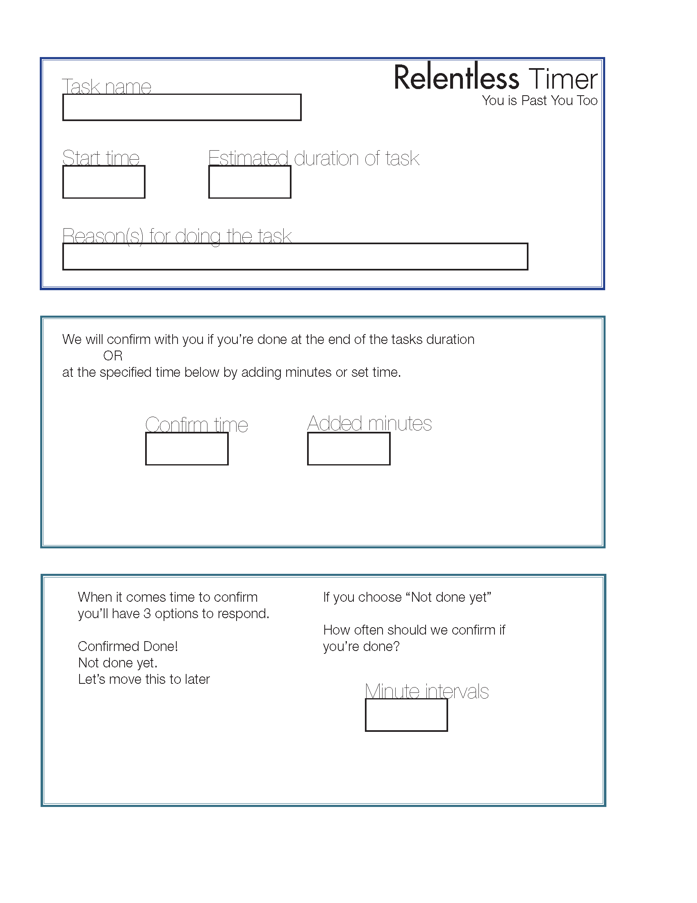
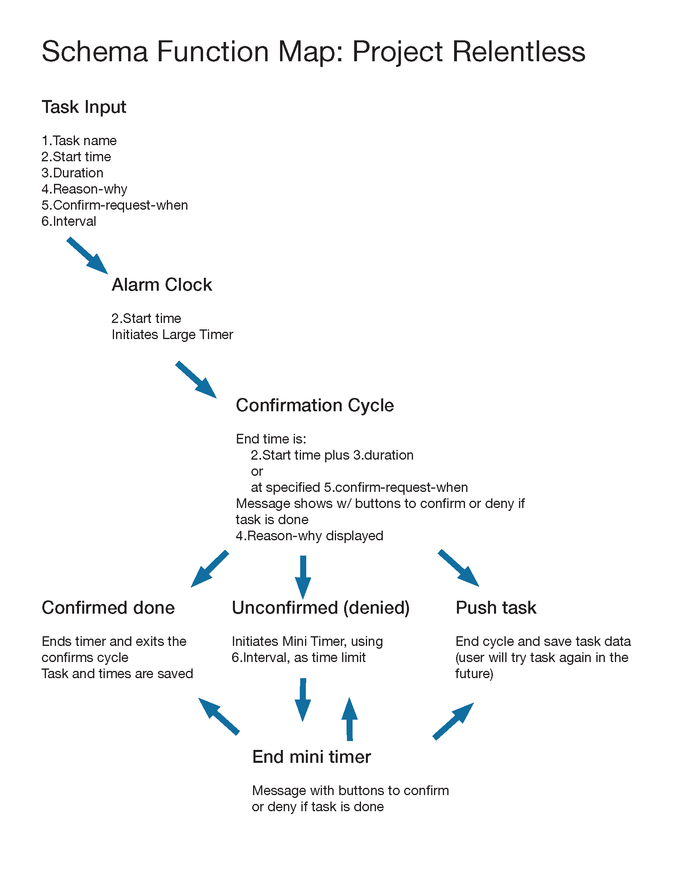

# Project Relentless Timer Habit Maker

A timer and reminder app for solidifying a new habit.

# Demo 

# Demo Site

Live version at [demo site](https://editor.p5js.org/DesignCJT/full/BkALH6xe4) in the online P5.js editor!

# Motivation

My work friend Andrew Jung and I wanted to collaborate for a portfolio worthy app. We were both instructors in the tennis industry with varying hours and we had each done coding projects in the past. He was interested in app development and I Data Science. We met up over a dozen times to create this app with intentions to take it to mobile and give it backend support that sadly didn’t come to fruition but we enjoyed getting this app to where it is and we may return to it someday in the future!  

### App goal

This app was built to solidify a habit by using a check-on-completion measure that isn’t satisfied until the task is acknowledged as complete as well as a self reasoning argument that is entered by the user and supplied at the time of the task. 

We often have a battle with our two selves, when there aren’t two of ourselves. There’s just me no and me later and you now and you later. In our english language we have different words for what tense of me and my actions are, along with other pyschological barriers to completing tasks that I’ve wanted myself to complete. This app tries to bridge that gap by supplying an argument from yourself to yourself.

We (Myself and Andrew) also wanted to have these arguments build up over time, optionally entered each time the user interacted with the task timer. Especially if the user needed to push this timer to a next future date instead of doing the task when they had set. The goal of this was to build the presence of encouraging and beneficial arguments into the way the user thought of the task. This is to help combat the in the moment comfort of not doing the task or negative emotions around the potentially unpleasant task itself. Hopefully, in the end a person could have built up enough positive future thought (usually things we struggle to do have good long term consequences and less favorable short term exchanges, like cutting into video game time). Enough so that someone could establish a singular habit to where they don’t need the timer eventually…

...until the next struggling task comes along!  

# Build Status

Status: functioning initial model

incomplete collaborative goal of usable app with backend storage

# Built With

P5.js a JavaScript environment created by [the Processing team](https://p5js.org/), to create a space where with little initial resistance one could create visual examples of code and play from an artist’s perspective. 

Used and deliberated on function maps

Explored end user use cases 

Worked over Slack and Trello

# Features

Working with system clock

Project Features (some pictured below credits)

* User interface work

* Function mapping

* Use case discernment 

# Installation

The online only editor is [here](https://p5js.org/). There is an editor for download and it functions but is no longer fully supported. 

# How to use

1. Have a task that you’d like to do

2. Have a reason you’d like to have future/continuous you do that task

3. Set the time you’d like to initiate the doing of said task

4. Set the estimated duration of time that task could take

5. This app will now remind you to start that task and provide your reason from earlier

6. Set how often the check in alarm will sound until the task is marked complete

7. Try to start the task at the start time 

8. At the end of the estimated duration an alarm will go off asking you if the task is complete, if yes, then you’re done, if no, the alarm is snoozed for how long you set it to be. This repeats until you mark complete. 

Example: When I get home later today from work I’d like to do 20min of yoga to destress. I usually get home before 6 so I’d like to start yoga at 6:10p and the duration to be 20min. If I don’t start right away I don’t want to be bothered every 2 mins by a repeating alarm so I’ll set it for the mark complete alarm for every 15 min if I’m not already done. 

Task: Yoga

Why?: To destress

Start time: 6:10p

Estimated duration: 20min

First alarm to check if I’m done: 6:30

If snoozed next alarm to check if I’m done: 6:45, then 7:00, 7:15, etc…

# Credits

Made using info from Coding Train [p5.js series](https://www.youtube.com/playlist?list=PLRqwX-V7Uu6Zy51Q-x9tMWIv9cueOFTFA) on Youtube

Overall project is a Collaboration between Andrew Jung, Calvin Tomaschko

and PM'd by Will Jung

